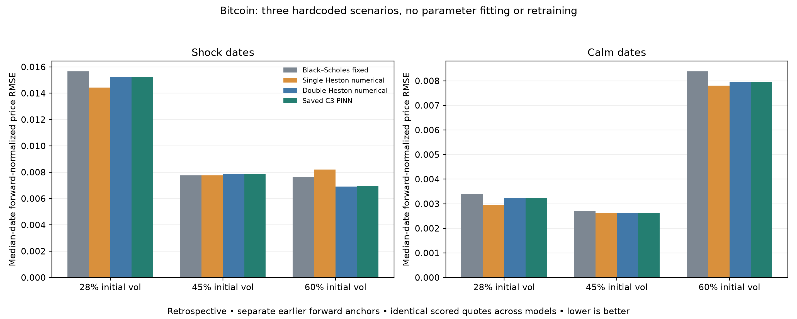
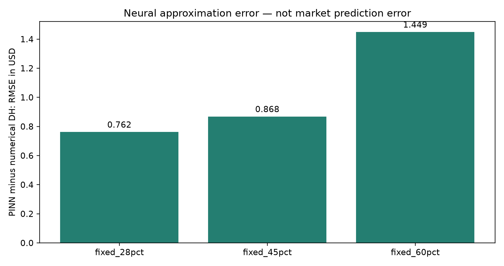

# Fixed-parameter saved PINN on Bitcoin options

**Retrospective exploratory test. No retraining, parameter fitting, winner selection, or future-price forecasting.**

Scored 201 authentic archived trade quotes over 10 of 51 requested dates. Date range: 2023-08-18 to 2026-02-11. Maturities: 7.00–67.04 days.

## Method

First hour [06:00,07:00) UTC only; latest trade/instrument. Three call-put pairs nearest anchor median index (max log K/index .36), timestamps within 10 minutes, index discrepancy <=0.5%. Median of (K+C_BTC*S_C-P_BTC*S_P)/mean(S_C,S_P). F at later trade = frozen ratio * its index. No target IV or price enters forward.

Latest trade/instrument in [07:00,08:00), excluding both option types of anchor strikes. Finite nonnegative premium, positive index, 7<=days<=730, |log(F/K)|<=.36, OTM only. No market IV, vega, or model-error filter. Report every exclusion.

Observed USD premium = BTC premium * contemporaneous index. Model USD premium = F * normalized numerical call/put. Zero USD discount rate assumed, same for all models. F/index basis is carried forward from first hour.

USD conversion follows [Deribit inverse-option documentation](https://support.deribit.com/hc/en-us/articles/31424939096093-Inverse-Options). Zero discounting and a stable first-hour forward/index ratio are explicit approximations.

## Parameters fixed before this run

Existing repository Chang/Wang/Zhang 2021 literature shape. 28% uses existing variance scaling. 45% and 60% are proposed stress states, 40/60 slow/fast share and structural scale 3.2, NOT published Bitcoin estimates.

SH numerical: published one-factor shape rescaled to match each DH initial and long-run total variance. BS: same fixed initial volatility. Neither comparator is a PINN or optimally calibrated.

Complete parameter values, source/weight hashes, dates and rules are in `protocol.json`. All three scenarios remain reported regardless of error.

## Market price error (all scored quotes)

| Fixed initial vol | Model | USD RMSE | USD MAE | Median-date normalized RMSE |
|---|---|---:|---:|---:|
| fixed_28pct | BS_fixed | 892.89 | 712.82 | 0.011308 |
| fixed_28pct | DH_PINN | 857.65 | 687.75 | 0.010231 |
| fixed_28pct | DH_numerical | 857.43 | 687.67 | 0.010222 |
| fixed_28pct | SH_numerical | 760.18 | 615.42 | 0.008033 |
| fixed_45pct | BS_fixed | 411.25 | 308.52 | 0.004718 |
| fixed_45pct | DH_PINN | 408.87 | 298.03 | 0.004000 |
| fixed_45pct | DH_numerical | 408.89 | 298.05 | 0.004001 |
| fixed_45pct | SH_numerical | 420.11 | 308.03 | 0.004083 |
| fixed_60pct | BS_fixed | 1028.19 | 774.40 | 0.008062 |
| fixed_60pct | DH_PINN | 845.94 | 649.17 | 0.007650 |
| fixed_60pct | DH_numerical | 845.01 | 648.61 | 0.007643 |
| fixed_60pct | SH_numerical | 786.20 | 608.50 | 0.008001 |

RMSE in dollars is per one-BTC underlying option premium, not position P&L. Daily medians give each date equal weight; pooled errors do not.

## PINN versus numerical Double Heston at identical parameters

| Scenario | USD RMSE | Forward-normalized RMSE | IV RMSE (vol points) | All inherited fidelity gates pass |
|---|---:|---:|---:|---|
| fixed_28pct | 0.7617 | 0.00000941 | 0.28680158961846197 | False |
| fixed_45pct | 0.8683 | 0.00000942 | 0.036998367003652756 | True |
| fixed_60pct | 1.4489 | 0.00001501 | 0.044871888852077796 | True |

This is a separate check from matching actual Bitcoin prices. Domain inclusion alone does not guarantee local fidelity.

## Integrity and limitations

- Every archived raw file and both saved C3 checkpoints are SHA-256 checked before and after the run.
- All second-hour targets and IV/mark fields were perturbed in memory: scored membership, forwards, network inputs and actual PINN predictions remained exactly unchanged on every scored date.
- Anchors precede every scored trade and anchor strikes are excluded from scoring. No original leaked forward columns or previous fitted Bitcoin parameter values are used.
- Numerical reference uses 96/128-node agreement and adaptive fallback. No model-price clipping; IV failures are counted without removing prices.
- Prior results on these dates have been viewed; not pristine test data.
- Asynchronous last trades, not synchronized bid/ask quotes; no execution or spread claims.
- Anchor forward estimates and assumed zero discounting can introduce model-independent pricing errors.
- No direct historic futures prices in archive; anchor basis held constant for the following hour.
- Three fixed hypotheses are not an optimization over Bitcoin parameters; no universal superiority or recovery claim.

The earlier BTC calibrated results are not comparable: this test changes parameter policy, units, forwards, scoring universe and time separation. A lower error here cannot prove universal model superiority.

## Figures

Interpretation: compare models within each fixed scenario and regime; every model sees the same quotes. Do not interpret the best displayed setting as independently validated.

Interpretation: this isolates the network approximation from the economic parameter mismatch. Small values here do not imply small market errors.

## Reproduce

`python experiments/btc_fixed_pinn_v1/run.py self-test` checks preprocessing and units. The original evaluation is frozen in artifacts/protocol.json. Do not overwrite it; a revised protocol requires a new experiment directory.

## Reporting-only repair

The scoring run completed and saved all scores/integrity checks, then hit a plotting identifier mismatch (`id` versus `scenario`). `finish_report.py` renders the same saved results with an in-memory alias. All frozen sources and score hashes remain unchanged; see `reporting_repair.json`.
