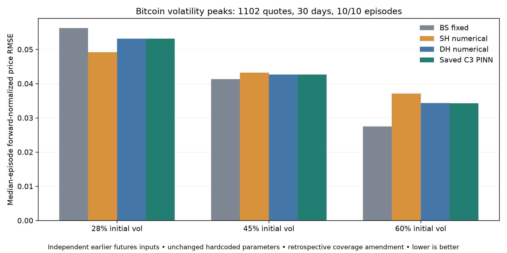

# Bitcoin peak-volatility test: independent futures inputs

**Retrospective coverage amendment, not independent confirmation. Same dates and hardcoded parameters as the strict-anchor peak test.**

Strict option-anchor stress test retained 27 quotes on two dates. Replace only forward input construction/anchor reservation using independent as-of futures, preserving all 30 selected dates, weights and parameter scenarios. Prior results have been seen; no confirmatory claim.

Rank complete archived daily DVOL closes descending; greedily retain the highest ten peaks at least 30 calendar days apart. Evaluate offsets +1,+2,+3. No replacements or model-error date selection.

Scored **1,102 authentic option trades on 30/30 days, spanning 10/10 selected episodes**. Maturities: 7.00–363.03 days.

## Forward inputs and units

Download the nearest three quarterly inverse BTC futures (last Friday each quarter), 06:00-08:00 UTC. For each scored option use last strictly earlier trade for each future, maximum age 15 minutes. Interpolate log(futures price / futures index) versus remaining expiry time, including (0,0). Beyond last maturity keep its annualized log carry constant. Multiply resulting ratio by the option trade index. No option premium or IV is used.

Observed USD option premium = reported BTC premium × contemporaneous index. Model prices use the independent futures-based forward and zero USD discounting. Log-basis interpolation is an estimated input, not a fabricated observed quote. Every supporting futures trade and its age is recorded in `scoring_quotes.csv`.

Carry extrapolation was required for 18/1102 scored quotes. Asynchronous trading, stale basis up to 15 minutes and zero-discounting assumptions remain limitations.

## Aggregate market error

| Fixed scenario | Model | Pooled USD RMSE | Pooled normalized RMSE | Median-episode normalized RMSE |
|---|---|---:|---:|---:|
| fixed_28pct | BS_fixed | 2435.05 | 0.058935 | 0.056284 |
| fixed_28pct | DH_PINN | 2318.93 | 0.056347 | 0.053154 |
| fixed_28pct | DH_numerical | 2318.86 | 0.056345 | 0.053151 |
| fixed_28pct | SH_numerical | 2168.32 | 0.052896 | 0.049183 |
| fixed_45pct | BS_fixed | 1861.34 | 0.045406 | 0.041347 |
| fixed_45pct | DH_PINN | 1920.44 | 0.046742 | 0.042717 |
| fixed_45pct | DH_numerical | 1920.61 | 0.046746 | 0.042722 |
| fixed_45pct | SH_numerical | 1939.72 | 0.047179 | 0.043205 |
| fixed_60pct | BS_fixed | 1284.63 | 0.031919 | 0.027530 |
| fixed_60pct | DH_PINN | 1581.23 | 0.038463 | 0.034317 |
| fixed_60pct | DH_numerical | 1581.45 | 0.038469 | 0.034323 |
| fixed_60pct | SH_numerical | 1705.25 | 0.041247 | 0.037090 |

## Episode consistency

| Scenario | PINN beats SH | PINN beats BS |
|---|---:|---:|
| fixed_28pct | 0/10 | 10/10 |
| fixed_45pct | 10/10 | 0/10 |
| fixed_60pct | 10/10 | 0/10 |

## Neural fidelity, not market error

| Scenario | PINN minus numerical DH USD RMSE | All inherited fidelity gates pass |
|---|---:|---|
| fixed_28pct | 0.3358 | True |
| fixed_45pct | 0.4543 | True |
| fixed_60pct | 0.5916 | True |

## Interpretation and limitations

- High volatility does not guarantee that Double Heston beats simpler models. Compare all retained episodes and all three fixed settings; do not select favorable dates.
- The settings are fixed in-domain hypotheses, not Bitcoin market calibrations. The peak-DVOL range is 92.31–156.20%, much higher than the 28/45/60% initial-state scenarios. DVOL and initial volatility are different quantities; the mismatch is a warning, not an identity.
- The original saved PINN remains unchanged. Parameter recovery, optimal calibration, future-price forecasting and universal market superiority are not established.
- Existing historical results had been seen before this coverage amendment. Parameter values, peak dates and scoring rules were frozen before the new futures-input scores; no settings were changed after those scores.
- The actual-network target-perturbation probes check that changing scored option targets cannot change their inputs or predictions. Additional tests check future-timestamp exclusion and 15-minute freshness. This does not prove absence of every bias.
- No synchronized bid/ask prices: no executable trading or spread-level accuracy claim.
- Ranking historical DVOL is hindsight stress selection, not a causal signal backtest. Peak closes precede scoring dates; whole-period ranks use the full history.

Interpretation: bars summarize market error equally by episode. Similar numerical-DH and PINN bars indicate that the neural calculator is reproducing Double Heston; they do not establish a market edge.

## Sources

[Deribit DVOL definition](https://insights.deribit.com/exchange-updates/dvol-deribit-implied-volatility-index/) · [Deribit inverse futures](https://support.deribit.com/hc/en-us/articles/31424938981533-Inverse-Futures) · [Inverse option units](https://support.deribit.com/hc/en-us/articles/31424939096093-Inverse-Options)

Full values and hashes: `protocol.json`. Futures provenance: `futures_downloads.json`, `futures_raw/`. Scores: `predictions.csv`, `metrics.csv`, `daily_metrics.csv`, `episode_metrics.csv`. Coverage and targeted invariance checks: `cleaning_audit.json`, `date_coverage.csv`, `leakage_probes.json`.
