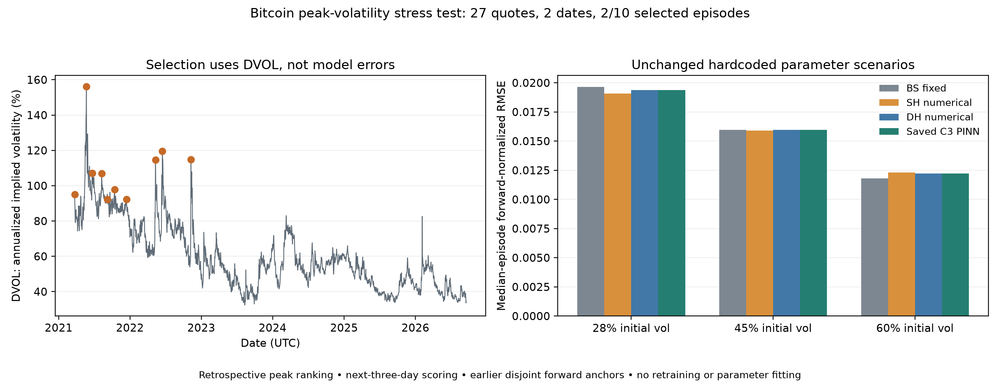

# Bitcoin peak-volatility stress test

**Descriptive retrospective stress test. All parameters, weights and cleaning rules unchanged. No best-setting selection.**

Independent indicator coverage: 2021-03-24 through 2026-09-17. Rank complete archived daily DVOL closes descending; greedily retain the highest ten peaks at least 30 calendar days apart. Evaluate offsets +1,+2,+3. No replacements or model-error date selection.

DVOL is 30-day annualized implied volatility, not realized returns volatility. Ranking the full historical indicator is hindsight event selection, not a deployable trading rule. The selected peak close itself precedes each scoring day.

Coverage: **27 quotes on 2/30 requested dates, from 2/10 episodes**. No missing date was replaced and no eligibility rule was relaxed.

## Selected independent volatility peaks

| Peak day | DVOL close (%) | Usable next-three-day dates |
|---|---:|---:|
| 2021-05-23 | 156.20 | 0/3 |
| 2022-06-16 | 119.65 | 0/3 |
| 2022-11-09 | 114.72 | 1/3 |
| 2022-05-12 | 114.58 | 0/3 |
| 2021-06-22 | 107.01 | 0/3 |
| 2021-08-09 | 106.97 | 0/3 |
| 2021-10-14 | 97.87 | 0/3 |
| 2021-03-24 | 95.04 | 1/3 |
| 2021-12-14 | 92.34 | 0/3 |
| 2021-09-08 | 92.31 | 0/3 |

## Frozen-scenario market errors

| Scenario | Model | Pooled USD RMSE | Pooled normalized RMSE | Median-episode normalized RMSE |
|---|---|---:|---:|---:|
| fixed_28pct | BS_fixed | 489.51 | 0.022790 | 0.019641 |
| fixed_28pct | DH_PINN | 481.75 | 0.022515 | 0.019374 |
| fixed_28pct | DH_numerical | 481.72 | 0.022515 | 0.019373 |
| fixed_28pct | SH_numerical | 474.89 | 0.022138 | 0.019069 |
| fixed_45pct | BS_fixed | 394.93 | 0.018634 | 0.015973 |
| fixed_45pct | DH_PINN | 394.10 | 0.018660 | 0.015972 |
| fixed_45pct | DH_numerical | 394.22 | 0.018661 | 0.015975 |
| fixed_45pct | SH_numerical | 391.63 | 0.018578 | 0.015890 |
| fixed_60pct | BS_fixed | 285.52 | 0.014015 | 0.011812 |
| fixed_60pct | DH_PINN | 294.79 | 0.014534 | 0.012225 |
| fixed_60pct | DH_numerical | 294.98 | 0.014541 | 0.012231 |
| fixed_60pct | SH_numerical | 296.37 | 0.014629 | 0.012298 |

## Episode-level consistency

| Scenario | PINN beats SH | PINN beats BS |
|---|---:|---:|
| fixed_28pct | 0/2 | 2/2 |
| fixed_45pct | 0/2 | 1/2 |
| fixed_60pct | 2/2 | 0/2 |

## Numerical fidelity, separate from market fit

| Scenario | PINN minus numerical DH USD RMSE | All inherited fidelity gates pass |
|---|---:|---|
| fixed_28pct | 0.0689 | False |
| fixed_45pct | 0.3024 | True |
| fixed_60pct | 0.4529 | True |

## Limitations and honesty

- Peak dates were selected only from DVOL, before loading or scoring their new option trades. Some dates were already present in earlier experiments; this is not pristine confirmation.
- The three hardcoded settings are unchanged, in-domain hypotheses, not Bitcoin-calibrated estimates. Initial volatility of 60% is far below many selected DVOL peaks, although the two quantities are not identical.
- The saved PINN was trained on a restricted literature-shaped family. Testing a much higher-volatility family requires a separately specified training protocol, not silently extrapolating this network.
- All data provenance, target-perturbation checks and checkpoint hashes are retained. Forward anchors are first-hour trades, disjoint from later scored strikes. No target IV enters forward estimation.
- Same-day forward basis and zero USD discounting are approximations; prices are asynchronous last trades, not bid/ask midpoints.
- A positive median difference is not proof of consistent superiority. Episode counts are descriptive; no post-hoc p-value claim is made.
- This selection cannot cover the March 2020 crash because DVOL history begins in March 2021.

Interpretation: orange markers identify the independently selected volatility peaks. On the right, lower bars indicate smaller market-price errors, aggregated with equal weight per episode. Similar DH numerical and PINN bars mean faithful model approximation, not necessarily good market fit.

## Sources and reproduction

[Deribit DVOL definition](https://insights.deribit.com/exchange-updates/dvol-deribit-implied-volatility-index/) · [Inverse-option pricing units](https://support.deribit.com/hc/en-us/articles/31424939096093-Inverse-Options)

`run_high_vol.py self-test` checks selection independence and the inherited preprocessing invariants. Frozen protocol and dates: `protocol.json`; original downloaded trade hashes: `downloads.json`; raw files: `raw/`; all scores: `predictions.csv`, `metrics.csv`, `episode_metrics.csv`; exclusions: `date_coverage.csv`, `cleaning_audit.json`.
