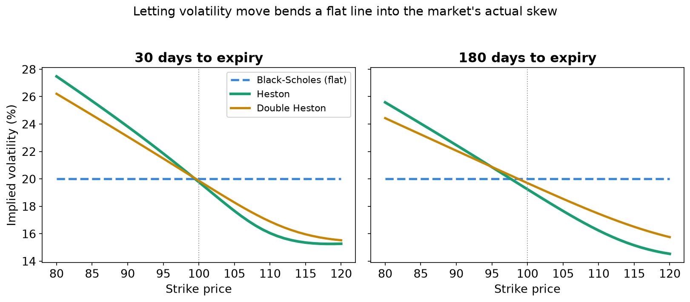
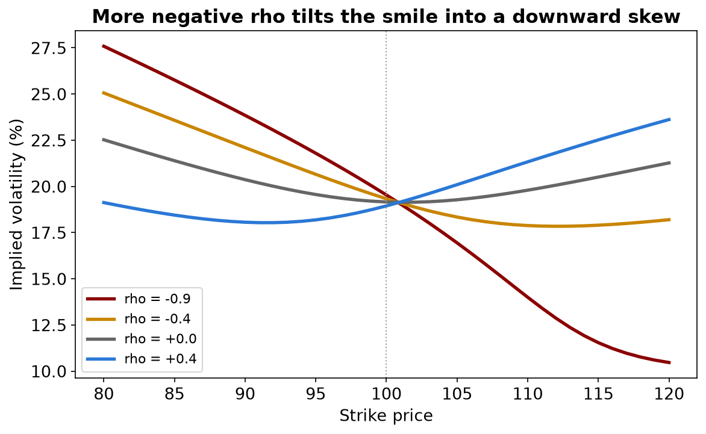
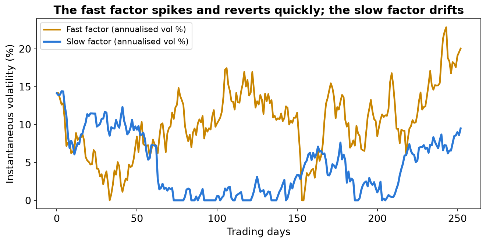
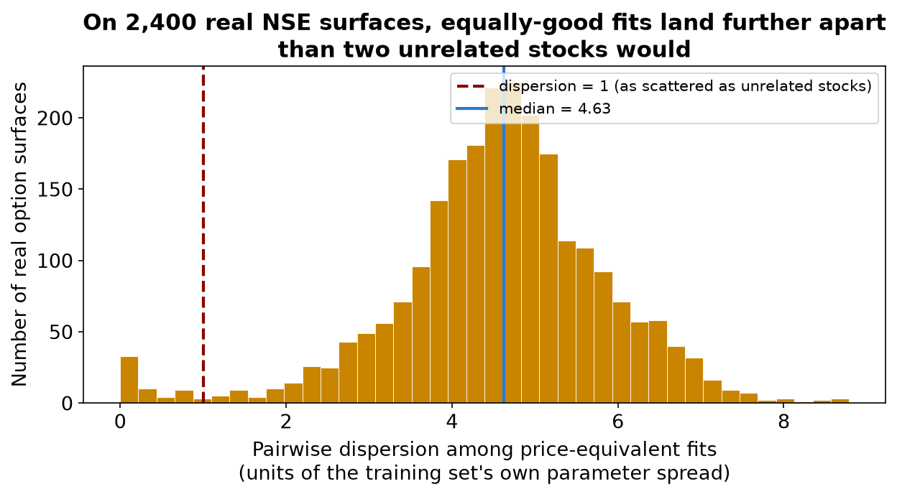

# From a Random Walk to Wall Street: Double Heston Option Pricing

## 1. The one-minute summary

This project builds and tests a chain of four option-pricing models — Black-Scholes, a Monte Carlo simulation of it, Heston, and Double Heston — implemented from scratch, calibrated to real Indian stock market data, and pushed until they break. Each model relaxes one assumption of the one before it. Black-Scholes assumes volatility never changes. Heston lets it move randomly, pulled back toward a long-run average. Double Heston gives it two independent sources of randomness instead of one, a fast one and a slow one.

The headline finding is not "which model prices options best." It's a sharper and more surprising result: Double Heston fits real market option prices very well — but the ten numbers that produced that good fit turn out not to be recoverable. Many completely different sets of parameters reproduce the same market prices almost exactly. This was proven twice, independently: once on simulated data where the correct answer is known in advance (the model recovers parameters worse than simply guessing the average), and once directly on 2,400 real option surfaces from 40 of the most actively traded stocks on the National Stock Exchange of India, using no assumed ground truth at all. Both point the same way.

*[Project credit: name, college, and event to be filled in before submission.]*

## 2. The problem: what an option is, and why pricing it is hard

An option is a contract that gives you the right, but not the obligation, to buy or sell a stock at a fixed price, called the strike, on or by a fixed date. You pay for that right upfront. A call option gives you the right to buy; a put gives you the right to sell.

Here's the everyday version. Suppose a stock trades at ₹100 today, and you think it might rise. You could buy the stock outright, but that ties up ₹100 and loses money if the stock falls. Instead, you could buy a call option with a strike of ₹100, expiring in a month, for say ₹3. If the stock rises to ₹115, your option is worth ₹15 — you made ₹12 after the cost of the option. If the stock falls to ₹90, your option is worthless, but you only lost the ₹3 you paid, not the ₹10 you would have lost holding the stock. That asymmetry — limited loss, open-ended gain — is exactly why options are worth pricing carefully. Get the price wrong and you're either overpaying for that asymmetry or selling it away too cheaply.

To price an option, you need five things: the stock's current price, the strike, the time remaining, the interest rate, and how much the stock is likely to move before expiry — its volatility. The first four you can simply look up. The fifth one, volatility, cannot be observed directly. It has to be estimated, or inferred backward out of option prices the market is already quoting. That single unknown is what every model in this project is really arguing about.

**Why Black-Scholes' constant volatility fails.** In 1973, Black, Scholes, and Merton solved the pricing problem beautifully under one simplifying assumption: volatility is one fixed number, true for every strike and every expiry, forever. This assumption is elegant and completely at odds with what real markets do. If you take real option prices and work backward to find the volatility that each one implies, you don't get one number — you get a different number for every strike. Out-of-the-money puts (the ones that pay off if the stock crashes) typically imply *higher* volatility than at-the-money options. Plot implied volatility against strike price and, instead of a flat line, you get a curve — a "smile" or, more often in equity markets, a downward-sloping "skew." Black-Scholes has no way to produce that shape. It can only ever draw a flat line, because it has no mechanism for volatility to be different in different scenarios.

## 3. The Heston idea: volatility that moves, but doesn't wander forever

Heston's 1993 model fixes this by making one change: instead of treating volatility as a constant, it treats the *variance* (volatility squared) as itself a random process — one that jitters around from moment to moment, but is pulled back toward a long-run average level the way a stretched rubber band is pulled back toward its resting length. The harder you stretch it (the further variance drifts from its average), the harder it gets pulled back.

There's a second, crucial ingredient: in real markets, when the stock price falls, volatility tends to rise. Crashes are turbulent; calm markets drift upward quietly. Heston's model captures this by correlating the random shocks to the stock price and the random shocks to variance — a negative correlation means a falling stock tends to come with rising volatility. This single correlation parameter is what actually bends Black-Scholes' flat line into the market's real skew: negative correlation makes low-strike, out-of-the-money puts (the ones that pay off in a crash) command a higher implied volatility than at-the-money or high-strike options, exactly the pattern real markets show.

This rubber-band-with-noise structure is not unique to finance — it is the same mathematics used to describe a physical quantity relaxing toward equilibrium while being kicked by random noise, the kind of process Einstein used in 1905 to explain the jittery motion of a pollen grain suspended in water. It's worth noting the historical order actually runs the other way: Louis Bachelier modeled stock prices as a random walk in his 1900 doctoral thesis, five years *before* Einstein used the same mathematics for Brownian motion in physics. Finance and statistical physics have been borrowing the same toolbox back and forth for well over a century.

## 4. Why "Double": two clocks instead of one

Heston's single random-volatility factor is a real improvement over a flat line, but it has a structural limit: it has one mean-reversion speed, one long-run level, one correlation. That's enough to bend the smile at any one expiry, but real markets show smiles that behave differently at different time horizons — a sharp, steep skew for options expiring next week, and a gentler, differently-shaped skew for options expiring in a year. A single Heston factor, tuned to fit the near-dated smile well, often fits the far-dated smile badly, and vice versa, because it only has one internal clock to work with.

Double Heston adds a second, independent source of randomness in volatility — think of it as two overlapping weather systems instead of one. One factor is typically fast: it reverts to its average quickly, so it governs short-term turbulence, the kind of thing that moves a one-week option's smile. The other factor is slow: it drifts for a long time before reverting, governing the broader, longer-running mood of the market, the kind of thing a six-month or one-year option's smile actually reflects. Because the two factors are independent, the model can let the short-dated and long-dated smiles move somewhat independently of each other — something a single Heston factor structurally cannot do — and it can let the *level* of volatility and the *steepness* of the skew move separately, since one factor can dominate variance level while the other dominates its higher-frequency wiggle.

## 5. The model, term by term

**Black-Scholes.** The stock price follows one equation:

  dS = (r − q) S dt + sigma × S dW

In words: the stock's price drifts upward at the risk-free rate r (adjusted for any dividend yield q), plus a random shock each instant, scaled by the stock's price and by sigma, one fixed number for volatility that never changes.

**Heston.** The stock still drifts and jitters, but now its instantaneous variance v (volatility squared) is itself random:

  dS = (r − q) S dt + sqrt(v) × S dW1
  dv = kappa × (theta − v) dt + xi × sqrt(v) dW2, with correlation rho between dW1 and dW2

**Double Heston**, as implemented in this project, uses two completely independent copies of that same variance equation, one per factor, and adds their contributions to the total variance:

  dS = (r − q) S dt + sqrt(v1) × S dW1 + sqrt(v2) × S dW2
  dv1 = kappa1 × (theta1 − v1) dt + xi1 × sqrt(v1) dZ1, correlation rho1 between dW1 and dZ1
  dv2 = kappa2 × (theta2 − v2) dt + xi2 × sqrt(v2) dZ2, correlation rho2 between dW2 and dZ2

The two factors are independent of each other — factor 1's noise dZ1 doesn't correlate with factor 2's noise dZ2 — but each factor has its own correlation to the stock's own returns. This is exactly the structure of the standard "double Heston" model in the literature (Christoffersen, Heston & Jacobs, 2009: two independent variance factors, each with its own correlation to returns), and this project's implementation matches it directly — no simplification or shortcut was taken there.

**Every symbol, plainly:**

| Symbol | Plain meaning | What happens to prices/the smile as it rises |
|---|---|---|
| S | Today's stock price | Higher S raises call prices, lowers put prices |
| K | Strike price | The fixed price written into the contract |
| T | Time to expiry, in years | More time means more can happen, so options are worth more |
| r | Risk-free interest rate | Slightly raises call prices, lowers put prices |
| q | Dividend yield | Slightly lowers call prices, raises put prices |
| v0 (or v0_slow, v0_fast) | Today's variance, the starting point | Higher v0 makes near-dated options pricier and their smile steeper |
| kappa | Mean-reversion speed — how fast variance snaps back to theta | Higher kappa makes variance more predictable, muting the smile at longer maturities |
| theta | The long-run average variance | Higher theta raises option prices generally, especially at longer maturities |
| xi | "Vol of vol" — how violently variance itself jumps around | Higher xi fattens the tails and steepens the smile's curvature |
| rho | Correlation between price shocks and variance shocks | More negative rho tilts the smile into a steeper downward skew |

**The Feller condition.** There's one technical wrinkle worth knowing about. The equation for variance involves a square root, and a square root of a negative number doesn't exist. Feller's condition, 2 × kappa × theta > xi², is the mathematical guarantee that variance can never actually reach zero, so the square root always has something valid to work with. Real markets routinely violate this condition — their implied vol-of-vol is simply too high relative to how fast variance reverts — so this project's simulator has to handle the case where the condition fails gracefully rather than assuming it away (see Section 6).

## 6. How this project computes prices

**Intuition first.** There are two independent ways this project computes an option price from a set of model parameters, and it checks them against each other.

The first is simulation: literally play out thousands of possible future paths for the stock (and, for Heston and Double Heston, for variance alongside it), see what the option would be worth at expiry on each imagined path, average the results, and discount back to today. This is Monte Carlo simulation — it's slow, but it's honest and easy to trust, because it's doing exactly what the model says should happen, thousands of times over.

The second is a much faster shortcut available for Heston and Double Heston specifically: their equations have a known "characteristic function," a kind of mathematical fingerprint that fully describes the probability distribution of where the stock could end up, without ever simulating a single path. There's a formula (Gil-Pelaez inversion) for turning that fingerprint directly into an option price through a numerical integral. It's noise-free and orders of magnitude faster than simulation, which matters enormously when calibrating a model, since calibration needs thousands of prices computed in the time it takes to run one optimization.

**The technical detail.** For the simulation path, this project uses Full Truncation Euler discretization (Lord, Koekkoek & van Dijk, 2010): at each small time step, variance is allowed to dip below zero on paper, but everywhere it's actually used — in the square root, in the drift, in the price step — it's floored at zero first. This is the standard, well-tested fix for the fact that a naive simulation can produce nonsense the moment variance goes negative, which happens routinely whenever the Feller condition doesn't hold. For the characteristic-function path, this project uses the "little trap" formulation (Albrecher et al., 2007) of Heston's original formula, which avoids a known numerical bug in the 1993 paper's original expression where a complex logarithm can silently jump across a branch cut for long-dated options and produce a wrong price without any visible error. The two methods are cross-checked against each other in this project's own test suite, and they agree.

## 7. Calibration: fitting the model to real market prices

Calibration here means: given a real set of option prices actually quoted for a stock, find the parameter values that make the model's own prices match them as closely as possible.

This project calibrates single-factor Heston live, against real option chains fetched from NSE (via the Upstox API for index options, and from wherever a ticker's own options are listed otherwise). It's a least-squares fit — adjust the five Heston parameters to minimize the gap between the model's prices and the market's, using multiple expiries spread from about three weeks out to a year, not just a couple of adjacent ones (fitting only nearby expiries leaves the mean-reversion speed essentially unconstrained, since that parameter is identified specifically by how the smile *changes* across time). Each quote is weighted by its own sensitivity to volatility (its "vega"), which turns a raw dollar-price fitting error into something closer to a volatility-point error — without that weighting, the fit chases whichever options are most expensive in absolute terms and ends up ignoring the far-out-of-the-money wings, which are exactly the part of the smile that carries the skew.

**Double Heston is deliberately never calibrated live**, and that omission is the actual finding of this whole project, not an oversight. Ten free parameters, fit against a single day's option chain, do not come back with a unique answer. This project proves that claim rigorously in two completely independent ways.

**First, on simulated data**, where the true parameters are known because the project's own code generated the surface in the first place: a classical least-squares optimizer, given every possible advantage — the exact target prices, many random starting points, unlimited iterations — fits those prices to 9.16×10⁻⁸ root-mean-square error, which is machine precision, roughly ten thousand times closer than any neural network trained on the same task achieves. And yet the *parameters* that optimizer recovers score a median "skill" of 1.80, where 1.0 means doing no better than simply guessing the population average and anything above 1.0 means doing *worse* than that. The optimizer found a parameter vector that reprices the surface almost perfectly while being badly wrong about the actual ten numbers, essentially at random, because more than one parameter vector reprices that surface almost perfectly. Restricting the comparison to only the fits that are truly price-equivalent (matching to within a tight tolerance) doesn't rescue this — the median skill there is 1.85, if anything slightly worse.

**Second, and more decisively, this same finding was reproduced directly from real market data**, with no simulation and no assumed ground truth anywhere in the calculation. The method: take one real stock's real option prices on one real trading day, and fit the same surface from sixteen different random starting points. If the surface genuinely determines the parameters, all sixteen fits should land in roughly the same place. Run across 40 of the most liquid stocks on the National Stock Exchange, across 63 separately audited trading dates — 2,400 real option surfaces in total — and 99% of them produce more than one meaningfully different set of parameters, each pricing that day's actual market quotes about equally well. The typical spread between those equally-good solutions, measured in units of how spread out parameter values naturally are across the whole training population, is 4.6 — meaning two different price-equivalent fits to the *same* real surface typically land further apart from each other than two *completely unrelated* stocks' parameters would. This isn't a modeling artifact or an optimizer failing to search hard enough — it was checked directly: the best fits the optimizer found genuinely do beat a single flat volatility on every one of those 2,400 surfaces, so the ambiguity is real, not a symptom of a bad fit.

## 8. Inside the website

The site is a seven-page Streamlit app. A visitor lands on **Home**, which fits live Heston to real NIFTY option prices on the spot, shows how many times more closely Heston tracks the market's actual smile than the best possible flat volatility can, and states the site's whole arc up front: four models, each fixing the last one's flaw, and then a catch. If the live data feed fails — venue wifi, a rate limit, a market holiday — the page falls back automatically to a previously captured snapshot of a real chain, clearly labeled as such rather than silently pretending to be live.

**Options 101** covers the vocabulary — call, put, strike, premium, moneyness, implied volatility — anchored to an interactive payoff diagram a visitor can adjust themselves. **Pricing models** is the working calculator: pick a ticker, a strike, an expiry, and a model, and see Black-Scholes, GBM Monte Carlo (the same Black-Scholes model priced by simulation instead of formula, included specifically as an engine sanity check — it should converge to the closed-form price as more paths are added), Heston, or Double Heston price that exact option, side by side with the market's own implied-volatility curve at that expiry. A "Calibrate Heston" button fits the five Heston parameters live to the current option chain; Double Heston's ten parameters are exposed as sliders for exploration, explicitly without a calibrate button, with the reason stated directly in the interface. **Volatility forecast** is a separate question from pricing — it asks whether EWMA or GARCH(1,1) forecasts of *future* volatility beat the naive assumption that next month looks like last month, scored honestly out-of-sample, and backed by a standalone 60-stock, ten-year walk-forward backtest for anyone wondering whether one ticker's result is a fluke. **Assumptions** lays out, plainly, every assumption Black-Scholes rests on, which of those this project's other models address and which it doesn't, and states outright that Double Heston's sliders are illustrative rather than fitted, for the reason proven on the next two pages. **Double Heston** is the research page: the full non-identifiability result, on synthetic data and on real NSE data, laid out with the actual numbers. **Whole market** lets a visitor pick any of 210 NSE-listed stocks with options and see, for that specific stock, the same two-panel contrast that is this project's core finding — the price fit is good and steady across every date, while the ten parameters behind that fit visibly jump around anyway.

Underneath, it's a Python codebase: Streamlit for the interface, NumPy and SciPy for the math (least-squares optimization, Brent's method for implied-volatility inversion), pandas for data handling, Plotly and Altair for the charts, and PyTorch for the neural-network side of the research (the models that attempt to learn the inverse mapping from option surface to parameters). Real-time market data comes from Upstox's API for NSE index options and from Yahoo Finance otherwise; historical price series come from Yahoo Finance throughout.

## 9. Results and worked examples

All figures below were generated by calling this project's own pricing functions directly, with the parameters stated, on a spot price of 100 and the project's own fixed risk-free rate.

**Figure 1** shows the central visual argument at two maturities: Black-Scholes draws a flat line by construction; both Heston and Double Heston bend that line into a downward-sloping skew, closely tracking each other, because a negative correlation parameter is doing the real work in both.

**Figure 2** isolates that one parameter: holding everything else fixed and sweeping rho from +0.4 down to −0.9 tilts the smile steadily from a mild upward slope into a pronounced downward skew, showing directly why rho is the parameter that controls the market's leverage effect.

**Figure 3** simulates one year of the two Double Heston variance factors side by side: the fast factor visibly spikes and snaps back within weeks, while the slow factor drifts across the whole year, illustrating the "two overlapping weather systems" idea concretely rather than just asserting it.

**Figure 4** is not illustrative — it's the project's own real result, plotted directly: the distribution of parameter dispersion among price-equivalent fits across all 2,400 real NSE surfaces this project evaluated, with the "as scattered as two unrelated stocks" threshold marked for scale. Most of the distribution sits to the right of that line.

**Worked examples**, all computed directly from this project's pricing functions with a spot of 100 and the project's own risk-free rate (5.33%):

- A one-year at-the-money call: **Black-Scholes 10.63**, **Heston 10.36**, **Double Heston 10.51** (Heston parameters: v0=theta=0.04, kappa=2.0, xi=0.5, rho=−0.7; Double Heston splits variance across a fast factor kappa=5.0 and a slow factor kappa=0.5, each contributing half). The three models agree closely at the money, which is expected — the smile's shape matters most away from the money, not at its center.
- A 30-day, 10%-out-of-the-money put (strike 90 against spot 100): **Black-Scholes 0.058**, **Heston 0.148** — Heston prices this option at roughly 2.5 times Black-Scholes' price, a direct, concrete illustration of how much a flat-volatility model can underprice the options that actually protect against a crash, exactly the gap that negative rho exists to close.
- The Black-Scholes Greeks for that one-year at-the-money call at 20% volatility: delta 0.643, gamma 0.0187, vega 0.373 (per volatility point), theta −0.0181 (per day), rho 0.537 (per interest-rate point).

## 10. Limitations and future improvements

**What this project's models don't handle.** None of the pricing here accounts for jumps — sudden, discontinuous moves like a crash or an earnings surprise. Heston's randomness is continuous; it makes tails fatter than Black-Scholes but still underestimates the very largest one-day moves real markets occasionally produce. Dividends are modeled as a parameter but left at zero throughout. Trading frictions — the bid-ask spread, the impossibility of hedging continuously — are ignored entirely; every price here is frictionless and mid-market. Interest rates are held at one fixed number across every maturity, rather than varying by tenor.

**What's specific to the real-market evaluation.** Free NSE bhavcopy data carries no bid/ask spread, only a closing print, so part of any repricing error reported is the gap between a closing price and a genuinely tradeable level, not model error. Real option chains are also incomplete — anywhere from 11 to 19 of a nominal 20 quoted strikes actually have usable prices on a given day — which the neural-network side of this project handles by taking the missing-quote pattern as an explicit input rather than inventing prices for gaps that don't exist.

**The central limitation, restated honestly.** This project does not conclude that Double Heston is a bad pricing model — quite the opposite; it reprices real markets well, clearly better than a flat volatility, and its equations correctly capture the leverage effect and multi-timescale smile behavior real markets show. The finding is narrower and, in a sense, more useful to know: a good price fit and a recoverable set of underlying parameters are different achievements, and this project shows concretely — on synthetic data with known ground truth, and independently on 2,400 real market surfaces — that the second one doesn't follow from the first. A practitioner who calibrates Double Heston to real quotes, gets an excellent-looking fit, and reports the resulting parameters as "the market's volatility structure" would be making a claim the data cannot actually support, with no way to detect that from the fit quality alone.

**Future directions.** A jump-diffusion extension (adding a Poisson jump process to either variance factor) would address the fat-tail gap directly and is a natural next step, since the pricing machinery here already handles a characteristic-function approach that jump terms extend cleanly. A more ambitious direction would be testing whether *additional* structure in the data — cross-sectional information from many stocks calibrated jointly, rather than one surface at a time — narrows the ambiguity the single-surface case shows so starkly; the market-wide results here are suggestive but were not designed to test that specific question.

## 11. Key takeaways

Black-Scholes' one fixed number for volatility cannot produce the smile real option markets actually show; Heston fixes this by letting volatility move randomly while reverting to a long-run average, and a negative correlation between price and volatility shocks is specifically what creates the market's realistic downward skew. Double Heston adds a second, independent source of volatility randomness — a fast component and a slow one — so that short- and long-dated smiles, and the level versus the shape of the smile, can move somewhat independently, exactly as this project's own equations implement it. Both Heston and Double Heston, implemented here two independent ways and cross-checked against each other, fit real Indian market option prices convincingly well. And yet this project's central, twice-proven finding is that fitting well and recovering the true underlying parameters are different problems: on synthetic data with a known answer, and separately on 2,400 real NSE option surfaces with no assumed answer at all, many genuinely different Double Heston parameter sets reproduce the same market prices almost exactly, so a good calibration fit is not evidence that the reported parameters mean anything.

## 12. Glossary

- **Call option** — the right to buy a stock at a fixed price.
- **Put option** — the right to sell a stock at a fixed price.
- **Strike** — the fixed price written into an option contract.
- **Premium** — what an option costs today.
- **Implied volatility** — the volatility that makes a pricing formula match a real market price.
- **Smile / skew** — the pattern of implied volatility being different at different strikes.
- **Variance** — volatility squared; the quantity Heston-type models actually treat as random.
- **Mean reversion** — the tendency of a quantity to drift back toward a long-run average.
- **Kappa** — the speed of that mean reversion.
- **Theta** — the long-run average level variance reverts to.
- **Xi (vol of vol)** — how violently variance itself moves.
- **Rho** — the correlation between shocks to the stock price and shocks to its variance.
- **Feller condition** — the mathematical condition (2×kappa×theta > xi²) guaranteeing variance never reaches zero.
- **Calibration** — fitting a model's parameters to match real observed market prices.
- **Characteristic function** — a mathematical "fingerprint" of a probability distribution, used here to price options without simulation.
- **Monte Carlo simulation** — pricing by simulating many random possible futures and averaging the outcomes.
- **Non-identifiability** — when more than one parameter set explains the observed data equally well, so no single answer can be recovered.
- **Feller-violating** — a parameter combination where variance can (in principle) reach zero; handled by this project's simulator rather than excluded.

## 13. FAQ

**Q: Does this app predict whether a stock will go up or down?**
No. Every model here prices options or forecasts *how much* a stock might move, never which direction. That distinction is stated explicitly on the Volatility Forecast page.

**Q: If Double Heston's parameters can't be recovered, why include it at all?**
Because that finding is only convincing if the model is actually implemented, priced correctly, and shown to fit real markets well — the identifiability problem is specifically about a model that *works*, not one that's broken. Double Heston prices real NSE quotes convincingly; it's the parameters behind that fit, not the fit itself, that turn out to be unrecoverable.

**Q: Is this the model's fault, or is the optimizer just not trying hard enough?**
Checked directly: the optimizer is given every advantage — exact target prices, many multi-starts, effectively unlimited iterations — and still fits prices to machine precision while recovering the wrong parameters. It isn't failing to search; it's finding a different, equally valid answer, because more than one exists.

**Q: How is this different from Heston not fitting perfectly?**
Heston (or Double Heston) can fit *very* well — the price-matching accuracy is not in question here at all. The issue is entirely about the ten (or five) numbers behind that fit, not the fit's quality.

**Q: Why does the site show live NSE data at all, given the venue's wifi could fail?**
Because live, current data is genuinely more convincing to a live audience than a static screenshot — the site just doesn't pretend it's live when it isn't; it falls back to a clearly labeled, previously captured snapshot automatically.

**Q: Why is Black-Scholes still worth including if it's known to be wrong?**
It's the baseline every other model has to beat, and it's still the closed-form building block every implied-volatility calculation (including Heston's own evaluation) relies on.

**Q: What's the practical takeaway for someone actually trading options?**
Don't mistake a good Double Heston calibration for a discovery about the market's true volatility structure. The prices it produces can be trusted; the ten parameters behind them, on their own, generally can't be.

**Q: Does this mean Double Heston is a bad model?**
No — it means calibration and parameter recovery are different tasks, and this project's real finding is precisely which one Double Heston can and can't deliver from a single day's option chain.

**Q: Could more data (more expiries, more strikes) fix the identifiability problem?**
Possibly, partially — but this project didn't test that directly, and it's flagged as a genuine open direction in Section 10 rather than assumed.

**Q: What data did the real-market results use?**
Official NSE bhavcopy closing prices for 210 NSE-listed stocks with options, across 60 trading dates, for the market-wide results; a focused 40-stock, 63-date subset with 16 optimizer starts per surface for the ambiguity study specifically.

## 14. References

- Black, F. and Scholes, M. (1973). *The Pricing of Options and Corporate Liabilities.* Journal of Political Economy.
- Heston, S. L. (1993). *A Closed-Form Solution for Options with Stochastic Volatility with Applications to Bond and Currency Options.* Review of Financial Studies.
- Christoffersen, P., Heston, S., and Jacobs, K. (2009). *The Shape and Term Structure of the Index Option Smirk: Why Multifactor Stochastic Volatility Models Work So Well.* Management Science.
- Lord, R., Koekkoek, R., and van Dijk, D. (2010). *A Comparison of Biased Simulation Schemes for Stochastic Volatility Models.* Quantitative Finance.
- Albrecher, H., Mayer, P., Schoutens, W., and Tistaert, J. (2007). *The Little Heston Trap.* Wilmott Magazine.
- Bachelier, L. (1900). *Théorie de la Spéculation.* Doctoral thesis, Sorbonne — the earliest known use of a random walk to model asset prices, predating Einstein's 1905 Brownian motion paper by five years.
- Gatheral, J. (2006). *The Volatility Surface: A Practitioner's Guide.* Wiley — cited by this project's own vega-weighting approach to calibration.
